class: dark middle

# Databases
> Verzamelingenleer

---

### Verzamelingenleer
# Te verwerven competenties

**Kennen**
- De definitie van een verzameling.
- Een venndiagram beschrijven.
- De definitie van bijzondere verzamelingen.
    - Universum (`𝕌`)
    - Lege verzameling (`∅`)
    - (Echte) deelverzameling (`⊂` | `⊆`)
    - (on)eindige verzamelingen
- De definitie van disjuncte verzamelingen. 

---
### Verzamelingenleer
# Te verwerven competenties

**Kunnen**
- Verzameling noteren aan de hand van opsomming.
- Verzameling noteren aan de hand van omschrijving.
- Verzamelingen weergevem in venndiagrammen.
- De bewerkingen gedefinieerd op verzamelingen toepassen.
    - Element van (`∈`)
    - Geen element van (`∉`)
    - Kardinaalgetal (`#`)
    - Unie (`∪`)
    - Doorsnede (`∩`)
    - Relatieve complement (`\`)
    - Absolute complement (<sup>c</sup>)
    - Symmetrisch verschil (`Δ`)

---
### Verzamelingenleer
# Verzameling
Een verzameling wordt gebruikt om een aantal `dingen te groeperen`. Deze dingen kunnen concrete zaken zijn maar ook abstracte begrippen.

**Definitie**
- Een verzameling is een `ongeordende` collectie van elementen.
- `Duplicaten` worden `niet` opgenomen in de verzameling.
- `Elementen` kunnen eender welke vorm aannemen, bijvoorbeeld:
    - getallen
    - dieren
    - kleuren
    - voertuigen 
    - ... 

---
### Verzameling
# Notaties
Verzamelingen kunnen op meerdere manieren worden weergegeven.

**Opsomming**
> A = {1,2,3,4,5,6}

**Omschrijving**
> A = {x | 0 < x < 7 }

**Venndiagram**

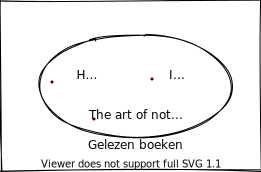

---
### Notaties
# Opsomming
- De verzameling kreeg de naam **A**.
    -  **A** = {1,2,3,4,5,6}
- De elementen van een verzameling noteren we tussen accolades.
    - A = **{**1,2,3,4,5,6**}**
- Spreek dit uit als
     - *"De verzameling A bevat de elementen 1,2,3,4,5 en 6."*
- Eindig
    - Verzamelingen gegeven door opsomming zijn steeds **eindig**.
- Volgorde
    - **Volgorde** speelt geen rol
    - A = {1,2,3,4,5,6} = {6,4,2,1,5,3}

---
### Notaties
# Omschrijving
- De verzameling kreeg de naam **B**.
    -  **B** = {x | x is een positief en even geheel getal}
- De elementen van een verzameling noteren we door omschrijving
    - B = {x | **x is een positief en even geheel getal**}
- Spreek dit uit als
     - *"B is de verzameling van alle elementen x waarvoor geldt dat x een positief en even geheel getal is"*
- Eindig | Oneiding
    - Verzamelingen door omschrijving kunnen **eindig** of **oneindig** zijn.
    - In dit geval is de verzameling B oneiding.

---
### Notaties
# Venndiagram


- Een `venndiagram` is een `benoemde` gesloten kromme. 
- Elementen worden voorgesteld door middel van `een punt`.
    - Indien mogelijk wordt dit punt `benoemd`. 
- Eindig | Oneiding
    - Verzamelingen door omschrijving kunnen **eindig** of **oneindig** zijn.
    - In dit geval is de verzameling A eindig.
    - Indien we willen aantonen dat de verzameling oneindig is gebruik dan **...** binnen het venndiagram.

---
### Verzanelingen
# Elementen die behoren tot
Stel:
A = {1,2,3}

**is element van**
- 1 ∈ A
- 2 ∈ A
- 3 ∈ A

**is geen element van**
- 0 ∉ A
- 4 ∉ A
- 9 ∉ A

---
### Verzanelingen
# Elementen die behoren tot
Aan de hand van een venndiagram


**is element van**
- C# ∈ Gekende Talen
- JAVA ∈ Gekende Talen

**is geen element van**
- PowerShell ∉ Gekende Talen
- Q# ∉ Gekende Talen

---
### Verzanelingen
# Aantal elementen
Het aantal elementen van een verzameling wordt het **kardinaalgetal** genoemd.


**Notatie**
- Venndiagram rechts
    - **#**Gekende Talen = 5
- Stel: A = {4,5,6}
    - **#**A = 3
    - Lees: *"Het aantal elementen van de verzameling A is 3".*


**Opmerking**
- Sommige verzamelingen zijn oneindig.
    - **#**B = ∞


---
### Verzamelingen
# Bijzondere verzamelingen
- **𝕌** Universum
- **∅** Lege verzameling
- **⊆** Deelverzameling
- **⊂** Echte Deelverzameling

---
### Bijzondere verzamelingen
# 𝕌 Universum
- Deze verzameling bevat **alle** objecten binnen een bepaalde context.
- Beschrijft steeds de volledige wereld waarin gewerkt wordt.
- Binnen verschillende disciplines niet steeds dezelfde verzameling.

**Voorbeelden**
- Fig 1 : Alle boeken ooit (**𝕌**)
- Fig 2 : Enkel de gelezen boeken 

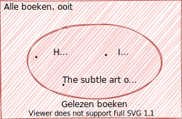
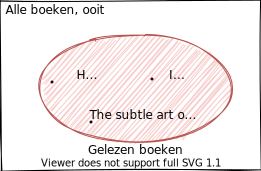

---
### Bijzondere verzamelingen
# ∅ Lege verzameling
- De lege verzameling is de verzameling die **geen enkel** element bevat.
> Opmerking
>
> De notatie is `∅` of `{}` maar **NIET `{∅}`**. Immers, **{∅}** is de verzameling met als element de lege verzameling en is bijgevolg niet leeg.


---
### Bijzondere verzamelingen
# ⊆ Deelverzameling
> A **⊆** B resp. A **⊈** B
>
> A is een deelverzameling van B als en slechts als elk element van A ook een element van B is.

Stel:
- A = {1, 2, 3}
- B = {1, 2, 3}
- C = {5, 6, 7}
- D = {0, 1, 2, 3, 4 ,5}
- E = {x | x ∈ ℕ }
    - ℕ zijn alle natuurlijke getallen

> Oefening: Welke verzamlingen zijn wel/geen deelverzamlingen van andere verzamelingen?

---
### ⊆ Deelverzameling
# Oefening
Stel:
- A = {1, 2, 3}
- B = {1, 2, 3}
- C = {5, 6, 7}
- D = {0, 1, 2, 3, 4 ,5}
- E = {x | x ∈ ℕ }

**Voorbeelden**
- A = B en B = A (als alle elementen gelijk zijn)
- A ⊆ D en A ⊆ E, maar D ⊈ A en E ⊈ A
- B ⊆ D en B ⊆ E, maar D ⊈ B en E ⊈ B
- C ⊆ E, maar E ⊈ C
- D ⊆ E, maar E ⊈ D
- A ⊆ B en B ⊆ A

---
### ⊆ Deelverzameling
# Venndiagram
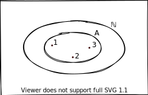


---
### Bijzondere verzamelingen
# ⊂ Echte Deelverzameling
> A **⊂** B resp. A **⊄** B
>
> A is een echte deelverzamling van B als A een deelverzameling van B is **en de verzamelingen niet gelijk zijn.**

Stel:
- A = {1, 2, 3}
- B = {1, 2, 3}
- C = {5, 6, 7}
- D = {0, 1, 2, 3, 4 ,5}
- E = {x | x ∈ ℕ }
    - ℕ zijn alle natuurlijke getallen

> Oefening: Welke verzamlingen zijn wel/geen **echte** deelverzamlingen van andere verzamelingen?

---
### ⊂ Echte Deelverzameling
# Oefening
Stel:
- A = {1, 2, 3}
- B = {1, 2, 3}
- C = {5, 6, 7}
- D = {0, 1, 2, 3, 4 ,5}
- E = {x | x ∈ ℕ }

**Voorbeelden**
- A = B en B = A (als alle elementen gelijk zijn)
- A ⊂ D en A ⊂ E, maar D ⊄ A en E ⊄ A
- B ⊂ D en B ⊂ E, maar D ⊄ B en E ⊄ B
- C ⊂ E, maar E ⊄ C
- D ⊂ E, maar E ⊄ D
- A **⊄** B en B **⊄** A

---
class: dark middle

# Verzamelingenleer
> Bewerkingen op verzamelingen

---
### Verzamelingen 
# Bewerkingen
Met twee of meerdere verzamelingen nieuwe verzamelingen vormen, kan door gebruik te maken van de de bewerkingen die gedefinieerd zijn op verzamelingen, hieronder enkele van deze bewerkingen.
- **∪** Unie
- **∩** Doorsnede
    - A ∩ B = ∅ Disjuncte verzamelingen 
- **\\** Relatief complement
- **<sup>c</sup>** Absoluut complement
- **Δ** Symmetrisch verschil

---
### Bewerkingen 
# Unie
A **∪** B = de **unie** van de verzamelingen A en B, de verzameling van alle elementen die tot A **of** tot B behoren.

Stel 
- A = Boeken in bezit
- B = Gelezen boeken
- C = A ∪ B = Alle unieke boeken die ik gelezen heb **of** waarvan ik eigenaar ben.

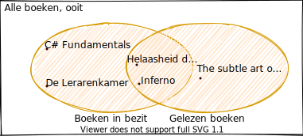

---
### Bewerkingen 
# Unie
C = A ∪ B 

```json
C = 
{
     C# Fundamentals
    ,De Lerarenkamer
    ,Helaasheid der dingen
    ,Inferno
    ,The subtle art of not given a f*ck
}
```
> Enkel de unieke waarden, waarbij de volgorde geen rol speelt.

---
### Unie 
# Voorbeelden
Stel: A = {1, 2, 5, 10}

Dan geldt:

- {3, 4} ∪ A = {1, 2, 3, 4, 5, 10}
    - de volgorde van de elementen is niet van belang
- {2, 3, 4, 5} ∪ A = {1, 2, 3, 4, 5, 10}
    -  in een verzameling wordt elk element maar 1 keer genoteerd
- A ∪ A = A
    - geldt natuurlijk voor om het even welke verzameling A
- A ∪ ∅ = A
    - dit geldt opnieuw voor om het even welke verzameling A
- A ∪ 𝕌 = 𝕌
    - het universum stelt steeds de volledige ‘wereld’ voor

---
### Unie 
# Oefening
Stel:
- A = {x | 0 < x < 10 waarbij x mod 2 = 0 }
- B = {x | 0 < x < 10 waarbij x mod 3 = 0 }
- C = A ∪ B 

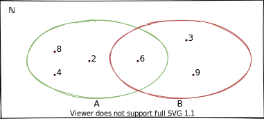

> Bepaal C door middel van opsomming en omschrijving, geef daarnaast #(A ∪ B)

---
### Unie 
# Oplossing


**Opsomming**

C = A ∪ B = {8,4,2,6,3,9}

**Omschrijving**

C = {Alle veelvouden van 2 of 3 die kleiner zijn dan 10 en groter dan 0}

C = {x | 0 < x < 10 waarbij x mod 3 = 0 of x mod 2 = 0 }

**#(A ∪ B)** = 6

---
### Bewerkingen 
# Doorsnede
A **∩** B = de **doorsnede** van de verzamelingen A en B,  de verzameling van alle elementen die tegelijkertijd tot A **en** tot B behoren.

Stel 
- A = Boeken in bezit
- B = Gelezen boeken
- C = A ∩ B = Alle unieke boeken die ik gelezen heb **en** waarvan ik eigenaar ben.

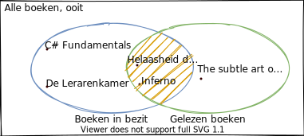

---
### Bewerkingen 
# Doorsnede
C = A ∩ B 

```json
C = 
{
     Helaasheid der dingen
    ,Inferno
}
```
> Enkel de unieke waarden, waarbij de volgorde geen rol speelt.

---
### Doorsnede 
# Voorbeelden
Stel: A = {1, 2, 5, 10}

Dan geldt:

- A ∩ {−1, 2} = {2}
    - de volgorde van de elementen is niet van belang
- A ∩ {3, 4} = ∅
    - Een opmerkelijk fenomeen (zie volgende slide)
- A ∩ A = A
    - dit geldt voor om het even welke verzameling A.
- A ∩ ∅ = ∅
    -  dit geldt voor om het even welke verzameling A.
- A ∩ U = A
    -  dit geldt voor om het even welke verzameling A.

---
### Doorsnede 
# Disjuncte verzamelingen
Twee verzamelingen A en B zijn **disjunct** als en slechts als hun **doorsnede** leeg is, dus als **A ∩ B = ∅**.

Stel: A = {1, 2, 5, 10}

Dan geldt:
- A ∩ {3, 4} = ∅
    - A en {3, 4} zijn disjunct. 

---
### Doorsnede 
# Oefening
Stel:
- A = {x | 0 < x < 10 waarbij x mod 2 = 0 }
- B = {x | 0 < x < 10 waarbij x mod 3 = 0 }
- C = A ∩ B 


> Bepaal C door middel van opsomming en omschrijving, arceer daarnaast C in een venndiagram.

---
### Doorsnede 
# Oplossing


**Opsomming**

C = A ∩ B = {6}

**Omschrijving**

C = {Alle veelvouden van 2 **en** 3 die kleiner zijn dan 10 en groter dan 0}

C = {x | 0 < x < 10 waarbij x mod 3 = 0 **en** x mod 2 = 0 }

**#(A ∩ B)** = 1

---
### Bewerkingen 
# Relatief Complement
A **\** B = het **relatief complement** van de verzameling A en B, de verzameling van alle elementen die tot A behoren maar niet tot B.

Stel 
- A = Boeken in bezit
- B = Gelezen boeken
- C = A **\** B = Alle unieke boeken waarvan ik eigenaar ben **en niet gelezen heb**.

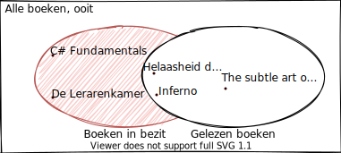

---
### Bewerkingen 
# Relatief Complement
C = A \ B 

```json
C = 
{
     C# Fundamentals
    ,De Lerarenkamer
}
```
> Enkel de unieke waarden, waarbij de volgorde geen rol speelt.

---
### Relatief Complement 
# Voorbeelden
Stel: A = {1, 2, 5, 10}

Dan geldt:

- A \ {−1, 2} = {1, 5, 10}
- A \ {3, 4} = A
- A \ A = ∅
    - dit geldt voor om het even welke verzameling A.
- A \ ∅ = A
    - dit geldt voor om het even welke verzameling A

---
### Bewerkingen 
# Absolute Complement
A<sup>c</sup> = het **abosulte complement** van de verzameling A, de verzameling van alle elementen die **tot 𝕌 behoren maar niet tot A**. In principe is dit gelijk aan 𝕌 \ A.

Stel 
- A = Gelezen boeken
- A<sup>c</sup> = 𝕌 \ A =  Alle unieke boeken die ik **niet gelezen** heb.

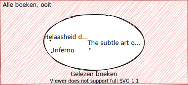

---
### Bewerkingen 
# Absolute Complement
C = A<sup>c</sup> 

```json
C = Alle boeken in de context, zonder:
{
     Helaasheid der dingen
    ,Inferno
    ,The subtle art of not giving a f*ck
}
```

---
### Absolute Complement 
# Voorbeelden
Stel:
- A = {1, 2, 5, 10}
- 𝕌 = {x | x ∈ ℕ<sub>0</sub> en x ≤ 10}
    - ℕ<sub>0</sub> : alle natuurlijke getallen zonder 0.

Dan geldt:
- A<sup>c</sup> = {3, 4, 6, 7, 8, 9}
- 𝕌<sup>c</sup> = ∅
- ∅<sup>c</sup> = 𝕌


---
### Bewerkingen 
# Symmetrisch Verschil
A Δ B = het **symmetrische verschil** van de verzameling A en B, de verzameling van alle elementen die **tot A OF B behoren maar niet tot A en B**.

Stel 
- A = Boeken in bezit
- B = Gelezen boeken
- C = A Δ B = Alle boeken die ik gelezen heb **of** waarvan ik eigenaar ben, maar niet diegene waarvan ik eigenaar ben **en** gelezen heb. 

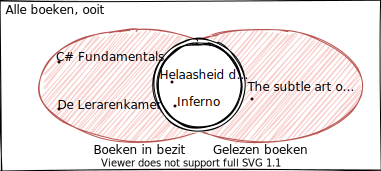

---
### Bewerkingen 
# Symmetrisch Verschil
C = A Δ B

```json
C = 
{
     C# Fundamentals
    ,De lerarenkamer
    ,The subtle art of not giving a f*ck
}
```

---
### Symmetrisch Verschil 
# Voorbeelden
Stel:
- A = {a, b, c, 1, 2, 3}
- B = {x, y, z, 1, 2, 3}

Dan geldt:
- A Δ B = {a, b, c, x, y, z}
- A Δ B = (A \ B) ∪ (B \ A)

---
class: dark middle

# Verzamelingenleer
> In de context van databanken

---
### Verzamelingenleer 
# In de context van databanken
Relationele databases zijn bijna volledig gebaseerd op verzamelingenleer.

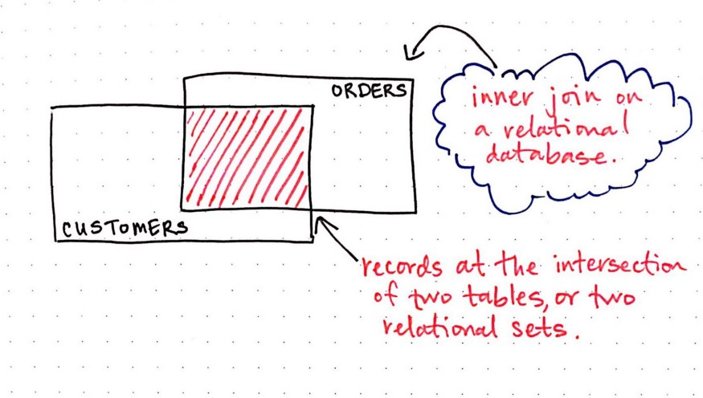

---
### Relationele Databanken
# SQL Statements
In feite zijn zelfs de meest gecompliceerde SQL statements niets meer dan bewerkingen op verzamelingen.


---
### Relationele Databanken
# Lees: verzamelingenleer
- Een `INNER JOIN` is slechts het **doorsnede** van twee verzamelingen.
- Een `LEFT JOIN` is niets anders dan het vinden van het **relatieve completement** van de twee tabellen.
- Een `FULL OUTER JOIN` is niets meer dan een **unie**
- Een `FULL OUTER JOIN` met `NULL` waarden is het vinden van een **symmetrisch verschil**.

> Hou dit in gedachten van zodra we beginnen over `JOINS` in de volgende lessen.

---
class: dark middle

# Databases
> Verzamelingenleer
>
> [Oefeningen]()
**Link naar Workshop (TODO)**


